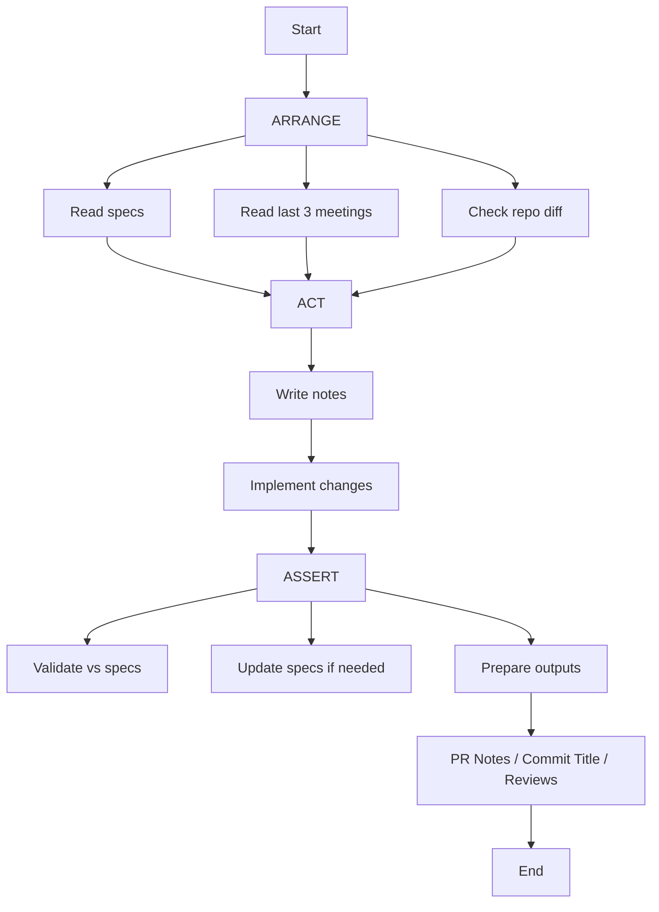

# Lotus Agents — Structure & Flow

## Directory Structure

.local/ (optional, auto-created)
- AGENTS.md → execution rules
- context.md → optional global context
- state.json → optional state
- issues/<id>.md → task definition
- issues-notes/<id>.md → execution notes
- runs/<timestamp>.md → run summary
- pr-notes/<id>.md → generated PR notes
- reviews/<id>-r<index>.md → review comments
- reviews/<id>-r<index>-answers.md → responses
- clarifications/<id>.md → Q/A for issue
- questions/q<timestamp>-<slug>.md → general questions

docs/ (optional, project-dependent)
- meetings/ → chronological notes
- specs/
  - features/
  - domains/
  - decisions/

---

## Optionality Rules

- If docs/ does NOT exist → DO NOT create
- If docs/ exists but different structure → DO NOT modify
- Fallback:
  - use .local/docs/* with same structure

---

## ID Sources

- <issue-id>:
  - from branch name OR
  - from user input OR
  - generated (e.g. timestamp)

- <index>:
  - review iteration (1,2,3...)

- <timestamp>:
  - YYYYMMDD-HHMM

---

## Flow (Mermaid)

## Meetings Interpretation Rules
- AI MUST read last 3 meetings
- priority:
  - newest overrides older context
  - all decisions remain relevant
- meetings are:
  - context source
  - NOT source of truth

## Questions Flow

When ambiguity exists during working on issue:
1. create or update: .local/questions/<issue-id>.md
2. stop execution and ask human to answer questions if these topics blocks you; otherwise continue and ask for fullfilling answers after current execution
3. if human will resume you or ask you to fullfill previuous changes, check answers and continue previously paused tasks

When ambiguity exists during creating/changing/updating docs:
1. create or update: .local/questions/q<timestamp>-<slug>.md (slug like for migrations, but for questions)
2. stop execution and ask human to answer questions if these topics blocks you; otherwise continue and ask for fullfilling answers after current execution
3. if human will resume you or ask you to fullfill previuous changes, check answers and continue previously paused tasks

## Review Flow
1. fetch review for given PR via gh
2. store structured comments (only new, previously added in other files omit)
3. create sub-issue (with <issue-id>-r<index> suffix, which means "revision X", index is just next int starting from 1)
4. process like normal issue (but with full new name `<issue-id>-r<index>` instead of `<issue-id>`)
5. generate answers for review