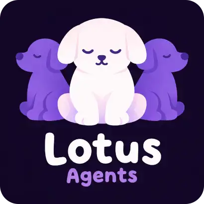

# Lotus Agents

<p align="center">
  
</p>

Lotus Agents is a simple way to structure human-agent work in a repository.
Instead of putting everything in one place, it separates private working notes
from durable project guidance:

- `.local/` for the agent's local working state
- `.docs/` for project knowledge worth keeping

## Quick Start

Install the main routing skill:

```bash
npx skills@latest add MrMaxie/lotus-agents --skill lotus-agents
```

If you want to set up the repository immediately:

```bash
npx skills@latest add MrMaxie/lotus-agents --skill lotus-init
```

Restart Codex after installation.

The repository also exposes a native plugin manifest in
`.codex-plugin/plugin.json` if you prefer that installation path.

## Update All Skills

To refresh every Lotus skill to the newest published version, run:

```bash
npx skills@latest add MrMaxie/lotus-agents --skill lotus-agents
npx skills@latest add MrMaxie/lotus-agents --skill lotus-init
npx skills@latest add MrMaxie/lotus-agents --skill lotus-spec-init
npx skills@latest add MrMaxie/lotus-agents --skill lotus-meeting-promote
npx skills@latest add MrMaxie/lotus-agents --skill lotus-pr-intake
```

## How It Works

The model is intentionally small:

```text
repo/
  .local/
    AGENTS.md
    issues/
    issues-notes/
    reviews/
    pr-notes/
  .docs/
    AGENTS.md
    spec/
      _toc.md    # when the branch has linked subfiles
    meetings/
      _draft.md
    templates/
    practices/   # optional
      _toc.md    # when the branch has linked subfiles
```

`.local/` is the private working layer. It should usually be ignored by Git.
For Lotus workflow state, local artifacts are the operational source of truth;
external providers are optional reference surfaces.

`.docs/` is the project layer. Keep specs, meeting notes, and reusable patterns
there. You can commit it or keep it local-only, depending on how you want to
run the project. During initialization, if you do not say which version you
want, Lotus should prefer hidden local-only `.docs/` for mature repositories
and committed `.docs/` for greenfield or bootstrap-only repositories.
Use `_toc.md` as the branch index in `.docs/spec/` and `.docs/practices/` when
those branches split into subfiles. Prefer small linked entity docs over one
large narrative page, keep them concise and in English, and call out code-facing
names exactly as used together with the context they belong to.

## Installable Skills

- **`lotus-agents`** - entrypoint skill that routes Lotus work to the right
  flow: setup, spec bootstrap, meeting promotion, or local-first
  issue/PR/review/CI intake.

  ```sh
  npx skills@latest add MrMaxie/lotus-agents --skill lotus-agents
  ```

  ```sh
  # Example prompts for the agent
  "Use $lotus-agents and initialize the Lotus workflow in this repo."
  "Use $lotus-agents and bootstrap .docs/spec for the current project."
  "Use $lotus-agents and prepare Lotus artifacts for the existing local work on issue 456."
  ```

- **`lotus-init`** - creates the base `.local/` + `.docs/` structure, seeds
  `.local/AGENTS.md`, `.docs/AGENTS.md`, and `.docs/meetings/_draft.md`, and
  chooses a default `.docs/` mode when you do not specify one: hidden
  local-only for mature repos, committed for early or bootstrap repos.

  ```sh
  npx skills@latest add MrMaxie/lotus-agents --skill lotus-init
  ```

  ```sh
  # Example prompts for the agent
  "Use $lotus-init in this repo. Keep .docs committed."
  "Use $lotus-init here, but keep .docs local-only for now and ignore it too."
  "Use $lotus-init and choose the default .docs mode from the current repo state."
  "Use $lotus-init and create .docs/practices as well."
  ```

- **`lotus-spec-init`** - bootstraps or refreshes `.docs/spec/` with an
  index-first Lotus spec starter and linked entity docs when the spec needs to
  branch.

  ```sh
  npx skills@latest add MrMaxie/lotus-agents --skill lotus-spec-init
  ```

  ```sh
  # Example prompts for the agent
  "Use $lotus-spec-init and create the first target-state spec for this repo."
  "Use $lotus-spec-init and follow the existing naming pattern in .docs/spec."
  "Use $lotus-spec-init and split the spec into linked entity docs when the topics are clearly separate."
  "Use $lotus-spec-init, but prefer the local .docs/templates/spec.md template."
  ```

- **`lotus-meeting-promote`** - turns `.docs/meetings/_draft.md` into a dated
  meeting note, keeps decisions and follow-ups explicit, and resets the draft
  template afterward.

  ```sh
  npx skills@latest add MrMaxie/lotus-agents --skill lotus-meeting-promote
  ```

  ```sh
  # Example prompts for the agent
  "Use $lotus-meeting-promote and promote the current draft meeting notes."
  "Use $lotus-meeting-promote. If the date or participants are unclear, ask me."
  "Use $lotus-meeting-promote and keep the existing meeting filename pattern."
  ```

- **`lotus-pr-intake`** - gathers issue, PR, review, and CI work into Lotus
  artifacts under `.local/issues/`, `.local/issues-notes/`, `.local/reviews/`,
  and `.local/pr-notes/`, treating those files as the operational source of
  truth and using remote providers only as optional supporting context.

  ```sh
  npx skills@latest add MrMaxie/lotus-agents --skill lotus-pr-intake
  ```

  ```sh
  # Example prompts for the agent
  "Use $lotus-pr-intake for the existing Lotus files for issue 456."
  "Use $lotus-pr-intake for PR #123 and prepare the Lotus artifacts."
  "Use $lotus-pr-intake for issue #456 and record assumptions in issue notes."
  "Use $lotus-pr-intake for issue #456, but only fetch GitHub context if the local files are missing what you need."
  "Use $lotus-pr-intake for this failed CI run and write PR notes for the user-facing changes."
  ```

If you are not sure where to start, install `lotus-agents` first and route
through `$lotus-agents`.

## Manual Adoption

If you do not want to install the skills, you can adopt Lotus manually:

1. copy `lotus-init/assets/local-agents.md` to `.local/AGENTS.md`
2. copy `lotus-init/assets/docs-agents.md` to `.docs/AGENTS.md`
3. create these directories:
   - `.local/issues/`
   - `.local/issues-notes/`
   - `.local/reviews/`
   - `.local/pr-notes/`
   - `.docs/spec/`
   - `.docs/meetings/`
   - `.docs/templates/`
4. create `.docs/meetings/_draft.md` from
   `lotus-init/assets/meetings-draft-template.md`
5. add `.local/` to `.git/info/exclude` or `.gitignore`
6. decide whether `.docs/` should be committed or local-only; when in doubt,
   prefer local-only for mature repos and committed for greenfield or
   bootstrap-only repos

## What Is In This Repo

The most important pieces are:

- `README.md`:
  the main human entrypoint
- `AGENTS.md`:
  working rules for this repository
- `lotus-*/`:
  the actual skills and their assets

If you want the details, read:

- `AGENTS.md` for repository rules
- `lotus-*/SKILL.md` for the behavior of each skill
