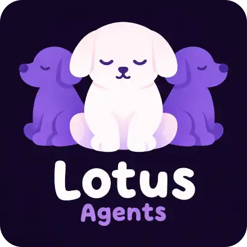

# Lotus Agents

<p align="center">
  
</p>

Lotus Agents is a simple way to structure human-agent work in a repository.
Instead of putting everything in one place, it separates private working notes
from durable project guidance:

- `.local/` for private working state or Linear-backed private config
- `.docs/` for project knowledge worth keeping
- Linear, optionally, for canonical operational issue and progress state

## Quick Start

Run the executable CLI without installing it first:

```bash
npx @maxiedev/lotusagents install
```

With Bun:

```bash
bunx @maxiedev/lotusagents install
```

Install it globally when you want a persistent command:

```bash
npm install --global @maxiedev/lotusagents
lotusagents install
```

Or install it with Bun:

```bash
bun add --global @maxiedev/lotusagents
lotus-agents update
```

Install the main routing skill:

```bash
npx skills@latest add MrMaxie/lotus-agents/lotus-local --skill lotus-agents
```

If you want to set up the repository immediately:

```bash
npx skills@latest add MrMaxie/lotus-agents/lotus-local --skill lotus-init
```

If you want the Linear-backed variant instead:

```bash
npx skills@latest add MrMaxie/lotus-agents/lotus-linear --skill lotus-linear-agents
```

Restart Codex after installation.

The repository also exposes a native plugin manifest in
`.codex-plugin/plugin.json` if you prefer to install both skill collections
through Codex.

The CLI exposes both `lotusagents` and `lotus-agents` binaries. It always
writes project artifacts into the current Git repository, even when the CLI was
launched through `npx`, `bunx`, or a global install. It orchestrates `install`,
`update`, `remove`, `doctor`, and `validate` commands inside a Git repository.
`install` starts a fresh install when no
Lotus-managed state is present, creates the base `.local/` and `.docs/`
managed artifacts, and routes to update when existing state is detected.
`update` offers the safe actions Update, Remove, and Cancel, filling in missing
managed artifacts without replacing present user-editable files. When
Lotus-managed artifacts are damaged, `update` reports a guided repair path
instead of overwriting files by default; `update --force` refreshes known
Lotus-managed files and directory metadata from bundled templates, preserving
existing directory contents, and warns before replacing user-editable managed
files. `remove` only deletes known Lotus-managed project artifacts. Managed
artifacts are identified through a Zod-validated manifest with
machine-readable metadata for scope, artifact type, schema version, content
version, privacy, selected profiles, selected agents, selected procedures,
content class, and migration strategy.

Useful command forms:

```bash
lotusagents install
lotusagents update
lotusagents update --force
lotusagents remove
lotusagents doctor
lotusagents validate
lotusagents install --profile linear-first --task-source linear-issues-connector --source-mode linear-issues-connector=operational
lotusagents install --task-source github-issues-connector --write-source github-issues-connector
```

`doctor` reports state and repair guidance. `validate` checks known managed
artifacts without changing files. `install --force` and `update --force`
replace known Lotus-managed files from bundled templates only when a forced
repair path is requested, scoped to the installed workflow profile when
`.local/workflow.lotus.json` can be read. Global package state is never removed
by `remove`.

Workflow profiles are selected independently:

- `local-first` is the default. `.local/` holds private operational notes and
  `.docs/` holds durable project guidance.
- `linear-first` keeps private project configuration in `.local/` while Linear
  is the operational source for issues, progress, and durable flow documents.
  `.docs/` still holds base durable agent guidance and reusable project
  templates.
  Local issue, review, and PR-note stores may still be installed as private
  execution notes or compatibility stores; they are not canonical state in this
  profile.
- selecting both profiles keeps local notes available while also documenting
  Linear as a configured source.
- selecting no profile is treated as a request to remove Lotus profile
  artifacts; use `--no-profiles` for this non-interactive path.

Task sources and source-of-truth modes are stored in
`.local/workflow.lotus.json`. Supported remote or interactive sources include
Jira through Rovo, GitHub issues through `gh`, GitHub issues through connector,
Linear issues through connector, GitHub PR comments through `gh`, GitHub PR
reviews through connector, Azure PR reviews through `az devops`, and Figma.
Every selected remote source defaults to readonly source of truth unless it is
configured as read/write or operational. `--write-source <source>` sets a
selected remote source to read/write by default unless `--source-mode` provides a
more specific mode. Local notes, local follow-ups, local reviews, and local
findings remain valid private sources regardless of selected remote tools.

Agent entrypoint generation supports Codex, OpenCode, Claude, and Cursor:

- `--recommended-agents` selects all detected agents
- `--agent <agent>` selects explicit agents and can be repeated
- `--no-agent-artifacts` skips agent entrypoint files
- Codex and OpenCode share `AGENTS.md`
- Claude uses `CLAUDE.md`
- Cursor uses `.cursor/rules/lotus.mdc`

Generated files point back to `.local/AGENTS.md` and `.docs/AGENTS.md`.
Existing non-Lotus files are reported and left untouched. Codex and OpenCode
share one common `AGENTS.md` entrypoint with aggregated `selectedAgents`
metadata; Claude and Cursor get their own entrypoints. Generated entrypoints
reference shared Lotus semantics instead of duplicating project workflow rules.

Managed local artifacts:

- `.local/AGENTS.md` uses frontmatter metadata and is private user-editable
  guidance.
- `.local/WORKFLOW.md` uses frontmatter metadata and is private user-editable
  workflow detail storage for local URLs, access notes, preferred tools, and
  interactive source notes.
- `.local/workflow.lotus.json` is the generated semantic workflow config.
- `.local/issues`, `.local/issues-notes`, `.local/reviews`, and
  `.local/pr-notes` use `.lotus.json` directory metadata.

Managed durable artifacts:

- `.docs/AGENTS.md` uses frontmatter metadata for project guidance.
- `.docs/spec` and `.docs/templates` use `.lotus.json` directory metadata.
- `.docs/meetings/_draft.md` is generated meeting draft content.

Manual edits are safe in `user-editable` artifacts as long as Lotus metadata is
kept intact. Do not remove or corrupt frontmatter metadata or `.lotus.json`.
`schemaVersion` describes the metadata shape; `contentVersion` tracks the
Lotus package version that produced the artifact.

## Local Development

Use Bun for this repository's local dependency and verification workflow:

```bash
bun install
bun run check
bun run typecheck
bun run test
bun run build
```

`bun.lock` is the repository lockfile. `package-lock.json` is intentionally not
kept because npm does not require it for packing or publishing the package, and
keeping two lockfiles would create dependency drift without a clear owner.

The package scripts are runner-neutral where possible, so the same checks can
run through Bun locally while NPM lifecycle behavior remains available for
release validation through commands such as `npm pack` or `npm publish --dry-run`.
`prepack` intentionally stays NPM-based because the package is published to NPM
and should keep validating that path.

## Release

Version the package in `package.json` and `.codex-plugin/plugin.json` before a
release. Run the local verification commands above, then use the GitHub Actions
Release workflow. The workflow installs with Bun, runs check/typecheck/tests,
builds, verifies package contents, smoke-tests a packed CLI in a temporary Git
repository, and publishes `@maxiedev/lotusagents` with provenance.

Publishing uses trusted publishing when the NPM package is configured for the
GitHub environment. If trusted publishing is not configured, set `NPM_TOKEN` in
the `npm` environment secrets. The package whitelist excludes `.local`, source
tests, coverage, fixtures, temporary files, and private development artifacts.

## Update All Skills

To refresh every local-first Lotus skill to the newest published version, run:

```bash
npx skills@latest add MrMaxie/lotus-agents/lotus-local --skill lotus-agents lotus-init lotus-spec-init lotus-meeting-promote lotus-pr-intake
```

To refresh every Linear-backed Lotus skill, run:

```bash
npx skills@latest add MrMaxie/lotus-agents/lotus-linear --skill lotus-linear-agents lotus-linear-init lotus-linear-intake
```

## How It Works

The local-first model is intentionally small:

```text
repo/
  .local/
    AGENTS.md
    issues/
    issues-notes/
    reviews/
    pr-notes/
  .docs/
    AGENTS.md
    spec/
      _toc.md    # when the branch has linked subfiles
    meetings/
      _draft.md
    templates/
    practices/   # optional
      _toc.md    # when the branch has linked subfiles
```

`.local/` is the private working layer. It should usually be ignored by Git.
For Lotus workflow state, local artifacts are the operational source of truth;
external providers are optional reference surfaces.
`.local/` stays repository-local and private even when the CLI itself is global.
Do not put durable project truth in `.local/`; use committed `.docs` or Linear
when another machine or agent must reproduce the work.

`.docs/` is the project layer. Keep specs, meeting notes, and reusable patterns
there. You can commit it or keep it local-only, depending on how you want to
run the project. During initialization, if you do not say which version you
want, Lotus should prefer hidden local-only `.docs/` for mature repositories
and committed `.docs/` for greenfield or bootstrap-only repositories.
Use `_toc.md` as the branch index in `.docs/spec/` and `.docs/practices/` when
those branches split into subfiles. Prefer small linked entity docs over one
large narrative page, keep them concise and in English, and call out code-facing
names exactly as used together with the context they belong to.

The Linear-backed variant keeps local private configuration in `.local/` and
moves operational and durable project state to Linear:

```text
repo/
  .local/
    AGENTS.md   # private Linear project configuration

Linear/
  issues       # task descriptions, remote ticket clones, review clones
  comments     # progress, PR-note proposals, reviewer reply proposals
  documents    # project flow rules and recurring operational guidance
  files        # project resources, specs, and durable context
```

For that variant, Linear is the operational source of truth. `.local/` stores
private configuration such as `linear_team`, `linear_project`,
`linear_flow_document`, `source_policy`, and
`external_writes: disallowed-by-default`. External systems such as Jira and
GitHub are read-only by default and are linked or cloned into Linear when the
project policy requires it.

Operational hygiene is configured through the `workflow-hygiene` procedure in
`.local/workflow.lotus.json`. After work, agents should record material
progress in the configured operational source, keep private reproduction data
under `.local`, avoid writing to readonly remote sources without approval, and
remove scratch files, logs, traces, and tool sessions that are not part of the
requested change.

## Installable Skills

- **`lotus-agents`** - entrypoint skill that routes Lotus work to the right
  flow: setup, spec bootstrap, meeting promotion, or local-first
  issue/PR/review/CI intake.

  ```sh
  npx skills@latest add MrMaxie/lotus-agents/lotus-local --skill lotus-agents
  ```

  ```sh
  # Example prompts for the agent
  "Use $lotus-agents and initialize the Lotus workflow in this repo."
  "Use $lotus-agents and bootstrap .docs/spec for the current project."
  "Use $lotus-agents and prepare Lotus artifacts for the existing local work on issue 456."
  ```

- **`lotus-linear-agents`** - entrypoint skill for the Linear-backed variant.
  It routes setup to `lotus-linear-init`, issue/PR/review/CI work to
  `lotus-linear-intake`, and durable project context to Linear resources.

  ```sh
  npx skills@latest add MrMaxie/lotus-agents/lotus-linear --skill lotus-linear-agents
  ```

  ```sh
  # Example prompts for the agent
  "Use $lotus-linear-agents and initialize Linear-backed Lotus here."
  "Use $lotus-linear-agents for this PR and capture the work in Linear."
  "Use $lotus-linear-agents and clone the remote Jira ticket into Linear."
  ```

- **`lotus-init`** - creates the base `.local/` + `.docs/` structure, seeds
  `.local/AGENTS.md`, `.docs/AGENTS.md`, and `.docs/meetings/_draft.md`, and
  chooses a default `.docs/` mode when you do not specify one: hidden
  local-only for mature repos, committed for early or bootstrap repos.

  ```sh
  npx skills@latest add MrMaxie/lotus-agents/lotus-local --skill lotus-init
  ```

  ```sh
  # Example prompts for the agent
  "Use $lotus-init in this repo. Keep .docs committed."
  "Use $lotus-init here, but keep .docs local-only for now and ignore it too."
  "Use $lotus-init and choose the default .docs mode from the current repo state."
  "Use $lotus-init and create .docs/practices as well."
  ```

- **`lotus-linear-init`** - creates or merges `.local/AGENTS.md` rules for
  Linear-backed operation. It keeps `.local/` private and does not create local
  operational issue, review, project-doc, or PR-note stores.

  ```sh
  npx skills@latest add MrMaxie/lotus-agents/lotus-linear --skill lotus-linear-init
  ```

  ```sh
  # Example prompts for the agent
  "Use $lotus-linear-init in this repo."
  "Use $lotus-linear-init and keep external writes disallowed by default."
  "Use $lotus-linear-init and preserve the existing Linear project settings."
  ```

- **`lotus-spec-init`** - bootstraps or refreshes `.docs/spec/` with an
  index-first Lotus spec starter and linked entity docs when the spec needs to
  branch.

  ```sh
  npx skills@latest add MrMaxie/lotus-agents/lotus-local --skill lotus-spec-init
  ```

  ```sh
  # Example prompts for the agent
  "Use $lotus-spec-init and create the first target-state spec for this repo."
  "Use $lotus-spec-init and follow the existing naming pattern in .docs/spec."
  "Use $lotus-spec-init and split the spec into linked entity docs when the topics are clearly separate."
  "Use $lotus-spec-init, but prefer the local .docs/templates/spec.md template."
  ```

- **`lotus-meeting-promote`** - turns `.docs/meetings/_draft.md` into a dated
  meeting note, keeps decisions and follow-ups explicit, and resets the draft
  template afterward.

  ```sh
  npx skills@latest add MrMaxie/lotus-agents/lotus-local --skill lotus-meeting-promote
  ```

  ```sh
  # Example prompts for the agent
  "Use $lotus-meeting-promote and promote the current draft meeting notes."
  "Use $lotus-meeting-promote. If the date or participants are unclear, ask me."
  "Use $lotus-meeting-promote and keep the existing meeting filename pattern."
  ```

- **`lotus-pr-intake`** - gathers issue, PR, review, and CI work into Lotus
  artifacts under `.local/issues/`, `.local/issues-notes/`, `.local/reviews/`,
  and `.local/pr-notes/`, treating those files as the operational source of
  truth and using remote providers only as optional supporting context.

  ```sh
  npx skills@latest add MrMaxie/lotus-agents/lotus-local --skill lotus-pr-intake
  ```

  ```sh
  # Example prompts for the agent
  "Use $lotus-pr-intake for the existing Lotus files for issue 456."
  "Use $lotus-pr-intake for PR #123 and prepare the Lotus artifacts."
  "Use $lotus-pr-intake for issue #456 and record assumptions in issue notes."
  "Use $lotus-pr-intake for issue #456, but only fetch GitHub context if the local files are missing what you need."
  "Use $lotus-pr-intake for this failed CI run and write PR notes for the user-facing changes."
  ```

- **`lotus-linear-intake`** - gathers issue, PR, review, and CI work into
  Linear issues, comments, documents, and status context. It treats Linear as
  the operational source of truth, requires exact links for remote-sourced work,
  and reads external systems by default instead of writing back to them.

  ```sh
  npx skills@latest add MrMaxie/lotus-agents/lotus-linear --skill lotus-linear-intake
  ```

  ```sh
  # Example prompts for the agent
  "Use $lotus-linear-intake for this Jira ticket and clone it into Linear."
  "Use $lotus-linear-intake for PR #123 and propose PR notes in Linear."
  "Use $lotus-linear-intake for this review comment and prepare a reply proposal."
  "Use $lotus-linear-intake for the current task and record progress in Linear."
  ```

If you are not sure where to start, install `lotus-agents` first. If Linear
should hold operational state, install `lotus-linear-agents`.

## Manual Adoption

If you do not want to install the skills, you can adopt Lotus manually:

1. copy `lotus-local/lotus-init/assets/local-agents.md` to `.local/AGENTS.md`
2. copy `lotus-local/lotus-init/assets/local-workflow.md` to `.local/WORKFLOW.md`
3. create `.local/workflow.lotus.json` through the CLI when possible so it is
   prefilled from selected profiles and task sources
4. copy `lotus-local/lotus-init/assets/docs-agents.md` to `.docs/AGENTS.md`
5. create these directories:
   - `.local/issues/`
   - `.local/issues-notes/`
   - `.local/reviews/`
   - `.local/pr-notes/`
   - `.local/screenshots/`
   - `.local/logs/`
   - `.docs/spec/`
   - `.docs/meetings/`
   - `.docs/templates/`
   - `.docs/practices/` when the project has durable engineering practices
6. copy the directory metadata manifests:
   - `lotus-local/lotus-init/assets/local-issues.lotus.json` to
     `.local/issues/.lotus.json`
   - `lotus-local/lotus-init/assets/local-issues-notes.lotus.json` to
     `.local/issues-notes/.lotus.json`
   - `lotus-local/lotus-init/assets/local-reviews.lotus.json` to
     `.local/reviews/.lotus.json`
   - `lotus-local/lotus-init/assets/local-pr-notes.lotus.json` to
     `.local/pr-notes/.lotus.json`
   - `lotus-local/lotus-init/assets/docs-spec.lotus.json` to
     `.docs/spec/.lotus.json`
   - `lotus-local/lotus-init/assets/docs-templates.lotus.json` to
     `.docs/templates/.lotus.json`
7. create `.docs/meetings/_draft.md` from
   `lotus-local/lotus-init/assets/meetings-draft-template.md`
8. add `.local/` to `.git/info/exclude` or `.gitignore`
9. decide whether `.docs/` should be committed or local-only; when in doubt,
   prefer local-only for mature repos and committed for greenfield or
   bootstrap-only repos
10. optionally create agent entrypoint files that point agents to
   `.local/AGENTS.md` and `.docs/AGENTS.md`; Codex and OpenCode use
   `AGENTS.md`, Claude uses `CLAUDE.md`, and Cursor uses
   `.cursor/rules/lotus.mdc`. The CLI can generate these automatically, and
   manual adoption can skip them when you invoke the skills directly.

For the Linear-backed variant:

1. copy `lotus-linear/lotus-linear-init/assets/local-agents.md` to `.local/AGENTS.md`
2. fill in `linear_team`, `linear_project`, `linear_flow_document`,
   `source_policy`, and `external_writes`
3. add `.local/` to `.git/info/exclude` or `.gitignore`
4. keep issue status, progress notes, review clones, PR-note proposals, and
   durable project context in Linear

## What Is In This Repo

The most important pieces are:

- `README.md`:
  the main human entrypoint
- `AGENTS.md`:
  working rules for this repository
- `package.json`:
  the publishable `@maxiedev/lotusagents` CLI package metadata
- `bun.lock`:
  the Bun-first repository lockfile
- `lotus-local/`:
  the local-first skill package and its assets
- `lotus-linear/`:
  the Linear-backed skill package and its assets

If you want the details, read:

- `AGENTS.md` for repository rules
- `lotus-local/*/SKILL.md` and `lotus-linear/*/SKILL.md` for the behavior of
  each skill
