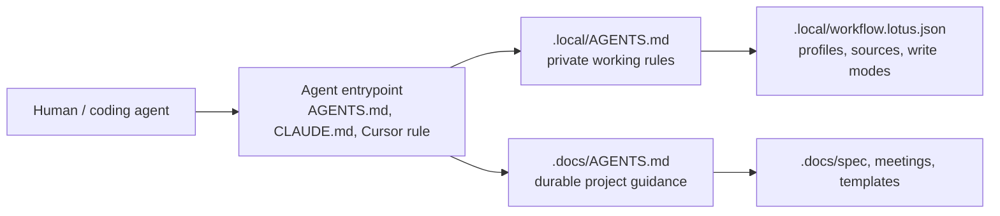

# Lotus Agents

<p align="center">
  
</p>

Lotus Agents gives coding agents a small, predictable project memory.

It installs repository-local workflow files that tell agents where to read rules, keep private working notes, and store durable project
guidance.

## At A Glance

| Need | Use |
| --- | --- |
| Install or repair Lotus workflow files in a repository | `@maxiedev/lotusagents` CLI |
| Keep private notes out of Git | `.local/` |
| Keep durable project guidance near the code | `.docs/` |
| Route Codex through reusable Lotus workflows | `lotus-local/` and `lotus-linear/` skills |
| Bundle Lotus skills as a native Codex plugin | `.codex-plugin/plugin.json` |

## Workflow Model


```mermaid
flowchart LR
  A["Human / coding agent"] --> B["Agent entrypoint<br>AGENTS.md, CLAUDE.md, Cursor rule"]
  B --> C[".local/AGENTS.md<br>private working rules"]
  B --> D[".docs/AGENTS.md<br>durable project guidance"]
  C --> E[".local/workflow.lotus.json<br>profiles, sources, write modes"]
  D --> F[".docs/spec, meetings, templates"]
```

`README.md` explains the package for humans. Generated agent entrypoints point tools back to `.local/AGENTS.md` and `.docs/AGENTS.md`.

## Install In A Repository

Run from the Git repository you want to configure:

```bash
npx @maxiedev/lotusagents install
```

With Bun:

```bash
bunx @maxiedev/lotusagents install
```

For a persistent command:

```bash
npm install --global @maxiedev/lotusagents
lotusagents install
```

The package exposes both binary names:

```bash
lotusagents install
lotus-agents install
```

The CLI writes only to the current Git repository. It does not manage global agent state.

## Pick A Workflow

| Workflow | Use when |
| --- | --- |
| Local-first | `.local/` holds private operational notes and `.docs/` holds durable guidance. |
| Linear-first | Linear should hold active work, progress, and durable operational context. |
| Combined | A repository needs local notes plus Linear routing. |

Local-first:

```bash
lotusagents install --profile local-first
```

Linear-first:

```bash
lotusagents install --profile linear-first --task-source linear-issues-connector --source-mode linear-issues-connector=operational
```

`linear-first` keeps only private local guidance, workflow config, and
reproduction notes in `.local/`. Active issue, review, progress, and PR-note
state belongs in Linear, and the workflow should not claim Linear-backed intake
until the Linear connector is actually available.

Combined:

```bash
lotusagents install --profile local-first --profile linear-first
```

If no profile is selected, Lotus removes profile-managed artifacts during update.

## What Lotus Creates

Lotus-managed files are intentionally small.

```text
repo/
  .local/
    AGENTS.md
    WORKFLOW.md
    workflow.lotus.json
    issues-notes/
    issues/       # local-first only
    reviews/      # local-first only
    pr-notes/     # local-first only
  .docs/
    AGENTS.md
    spec/
    meetings/
      _draft.md
    templates/
```

| Path | Purpose | Commit it? |
| --- | --- | --- |
| `.local/` | Private, machine-local working state for agents. | No. Keep it in `.git/info/exclude`. |
| `.docs/` | Durable project guidance, specs, meeting notes, and templates. | Yes when the team should share it. |
| `AGENTS.md` | Shared Codex and OpenCode entrypoint. | Usually yes. |
| `CLAUDE.md` | Claude entrypoint. | When generated for the repository. |
| `.cursor/rules/lotus.mdc` | Cursor entrypoint. | When generated for the repository. |

Agent entrypoints stay short. They point back to `.local/AGENTS.md`, `.docs/AGENTS.md`, and `.local/workflow.lotus.json` instead of
duplicating the workflow.

## CLI Commands

| Command | What it does |
| --- | --- |
| `lotusagents install` | Creates missing Lotus artifacts. Routes to update when Lotus already exists. |
| `lotusagents update` | Adds missing managed artifacts without replacing user-editable files. |
| `lotusagents update --force` | Repairs known Lotus-managed files from bundled templates. Use for repair paths. |
| `lotusagents remove` | Deletes known Lotus-managed project artifacts. It does not uninstall the global package. |
| `lotusagents doctor` | Reports current state and repair guidance. |
| `lotusagents validate` | Checks managed artifact metadata without changing files. |

Useful install options:

```bash
lotusagents install --recommended-agents
lotusagents install --agent codex --agent cursor
lotusagents install --no-agent-artifacts
lotusagents install --task-source github-issues-connector --write-source github-issues-connector
```

Supported agents:

| Agent | Generated entrypoint |
| --- | --- |
| `codex` | `AGENTS.md` |
| `opencode` | `AGENTS.md` |
| `claude` | `CLAUDE.md` |
| `cursor` | `.cursor/rules/lotus.mdc` |

## Task Sources

Remote and interactive task sources are read-only by default. Use `--write-source <source>` or `--source-mode <source=mode>` when the
repository workflow should allow writes.

| Source | Typical use |
| --- | --- |
| `jira-rovo` | Jira work through Atlassian Rovo. |
| `github-issues-gh` | GitHub issues through the `gh` CLI. |
| `github-issues-connector` | GitHub issues through the connector. |
| `linear-issues-connector` | Linear issues through the connector. |
| `github-pr-comments-gh` | GitHub PR comments through the `gh` CLI. |
| `github-pr-reviews-connector` | GitHub PR reviews through the connector. |
| `azure-pr-reviews-az-devops` | Azure DevOps PR review work. |
| `figma` | Figma-backed design tasks. |

## Install Codex Skills

Install the local-first router:

```bash
npx skills@latest add MrMaxie/lotus-agents/lotus-local --skill lotus-agents
```

Install the Linear-backed router:

```bash
npx skills@latest add MrMaxie/lotus-agents/lotus-linear --skill lotus-linear-agents
```

The native Codex plugin manifest lives at `.codex-plugin/plugin.json`.

| Skill | Purpose |
| --- | --- |
| `lotus-agents` | Routes local-first Lotus tasks. |
| `lotus-init` | Creates the base `.local/` and `.docs/` structure. |
| `lotus-spec-init` | Starts or refreshes `.docs/spec/`. |
| `lotus-meeting-promote` | Promotes `.docs/meetings/_draft.md` into a dated meeting note. |
| `lotus-pr-intake` | Captures issue, PR, review, and CI work into local Lotus artifacts. |
| `lotus-linear-agents` | Routes Linear-backed Lotus tasks. |
| `lotus-linear-init` | Creates Linear-backed private configuration. |
| `lotus-linear-intake` | Captures issue, PR, review, and CI work into Linear-backed state. |

## Local Development

Use Bun for repository work:

```bash
bun install
bun run check
bun run typecheck
bun run test
bun run build
bun run clean
```

Use `bun run clean` after local package verification when generated artifacts such as `dist/`, `package-smoke/`, `pack-dry-run.json`,
or root package tarballs should be removed. The command keeps `node_modules/`, `.docs/`, coverage output, nested tarballs, and private
`.local/` state intact.

`bun.lock` is the repository lockfile. `package-lock.json` is intentionally not kept because npm does not require it for packing or
publishing the package.

The package scripts are runner-neutral where possible, so the same checks can run through Bun locally while NPM lifecycle behavior remains
available for release validation through commands such as `npm pack` or `npm publish --dry-run`. `prepack` stays NPM-based because the
package is published to NPM.

## Release

1. Update the version in `package.json` and `.codex-plugin/plugin.json`.
2. Run the local checks.
3. Use the GitHub Actions release workflow.

The release workflow installs dependencies with Bun, runs checks and tests, builds the package, verifies package contents, smoke-tests the
packed CLI in a temporary Git repository, and publishes `@maxiedev/lotusagents`.

Publishing uses npm trusted publishing when configured. Otherwise, set `NPM_TOKEN` in the `npm` environment secrets.

## Repository Map

| Path | Role |
| --- | --- |
| `README.md` | Human entrypoint. |
| `AGENTS.md` | Repository rules for agents working here. |
| `package.json` | Publishable `@maxiedev/lotusagents` package metadata. |
| `bun.lock` | Bun-first repository lockfile. |
| `src/` | CLI source. |
| `assets/` | Package assets. |
| `lotus-local/` | Local-first skill package. |
| `lotus-linear/` | Linear-backed skill package. |
| `.codex-plugin/plugin.json` | Native Codex plugin manifest. |
